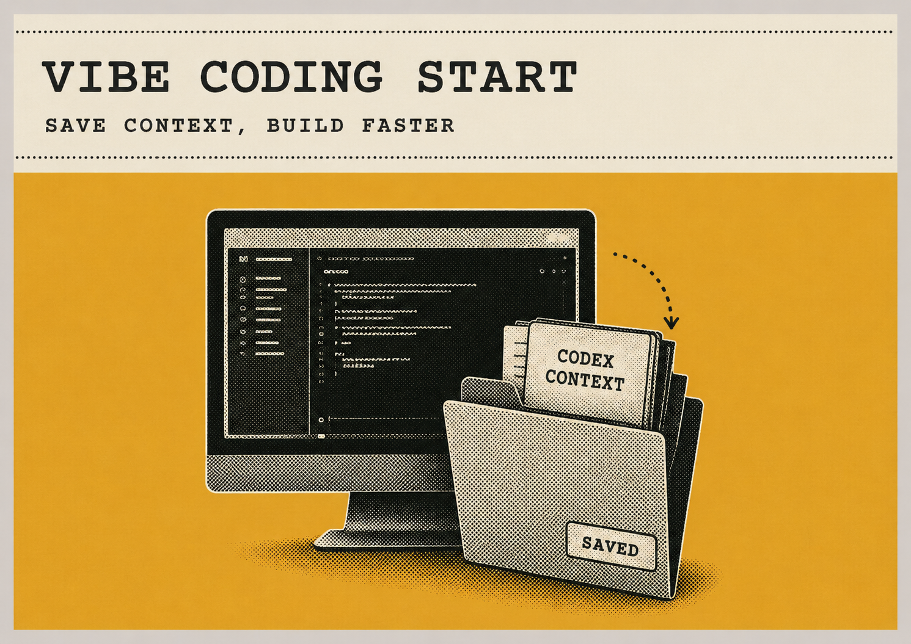

# VibeCoding Start（中文）

<p align="center">
  
</p>

<p align="center">
  <strong>Language / 语言</strong><br>
  <a href="README.md"><kbd>English</kbd></a>
  &nbsp;|&nbsp;
  <a href="README.zh-CN.md"><kbd>中文</kbd></a>
</p>

VibeCoding Start 是一个只包含 Skills 的 Codex Plugin，用于让 AI 辅助的软件项目从第一轮会话开始保留意图、需求、决策、证据和当前状态。

这是面向使用者的中文说明。规范性工程标准仍以英文的 [`standard-v1.3.md`](plugins/vibecoding-start/skills/vibecoding-project-knowledge/references/standard-v1.3.md) 为准；本文件不复制一份会与英文标准产生漂移的完整中文标准。

## 为什么需要它

没有工程工作流时，AI 构建的项目容易沿着下面的路径增长：

```text
想法 → Prompt → 代码 → 更多代码 → 上下文丢失 → 难以维护
```

VibeCoding Start 把路径固定为：

```text
PRODUCT → PRD → ACCEPTANCE → Reuse → Plan
→ Build → Review → Verify → Accept → Release → Observe
```

项目会先得到一套轻量的知识骨架。小项目保持短小；只有实际复杂度和风险需要时，才增加更深入的架构、测试、运维、发布或事故记录。

## 它提供什么

- 先写 PRD，再开始实质性编码
- 先搜索现有能力、标准库、官方工具和成熟方案，再决定是否自定义实现
- 建立 `INDEX / PRODUCT / PRD / ACCEPTANCE / CURRENT / CODEMAP`
- 对重要变更进行独立评审、反例验证和人类可读的验收
- 让原始项目记忆默认留在本地，不把 `.project-memory` 原文提交到公共仓库
- 通过 Small/Medium/Large 深度规则，避免小项目被迫创建空的企业级目录

## 文档入口

- [English README](README.md) — 英文首页和完整安装说明
- [项目知识索引](docs/INDEX.md) — 仓库的主动文档地图
- [Small-project path](docs/examples/small-project/README.md) — 紧凑的项目示例
- [Engineering standard v1.3](plugins/vibecoding-start/skills/vibecoding-project-knowledge/references/standard-v1.3.md) — 规范性 G0-G9 标准，英文为准
- [Scaling rules](plugins/vibecoding-start/skills/vibecoding-project-knowledge/references/scaling-rules.md) — Small/Medium/Large 的深度和文件最低要求
- [Cross-Agent usage notes](docs/CROSS-AGENT.md) — 多个 coding agent 如何共享项目事实
- [贡献指南](CONTRIBUTING.md) — 本地检查、PR 要求和隐私边界
- [安全政策](SECURITY.md) — 安全问题报告和敏感信息处理方式
- [CHANGELOG](CHANGELOG.md) — 版本历史和迁移说明
- [GitHub Releases](https://github.com/kktbur/VibeCoding-Start/releases) — 固定版本的公开发布记录

## 安装

把仓库添加为 Codex Plugin marketplace，然后安装 Plugin。下面的命令固定到已经发布并验证过的 `v0.3.0`：

```bash
codex plugin marketplace add https://github.com/kktbur/VibeCoding-Start --ref v0.3.0
codex plugin add vibecoding-start@kktbur
```

如果你明确要使用最新开发状态，可以使用 `main`：

```bash
codex plugin marketplace add https://github.com/kktbur/VibeCoding-Start --ref main
codex plugin add vibecoding-start@kktbur
```

如果使用本地 checkout：

```bash
codex plugin marketplace add ./VibeCoding-Start
codex plugin add vibecoding-start@kktbur
```

安装或更新后，请启动一个**新的** Codex session，然后调用：

```text
$vibecoding-start
I want to build a small local file-renaming tool.
```

## 隐私边界

原始 session、命令输出、失败尝试、调查记录和测试产物默认保存在本地 `.project-memory/`，并由 Git 忽略。稳定事实写入 `docs/`；公开示例只有在脱敏并经过人工审查后才进入 `docs/examples/`。

这个 Plugin 不会主动上传项目记忆，也不包含 memory database、vector database、search engine、testing framework、deployment framework、MCP server 或 hosted observability backend。不要在 Issue、PR、截图或日志中粘贴 token、cookie、私钥、密码或 `.project-memory` 原文。

## 兼容性与维护

本仓库是 Skill-only Plugin 的公开源代码，使用标准的 `SKILL.md`、可选 `agents/openai.yaml` 和 `.codex-plugin/plugin.json` 结构。安装后如果 `$vibecoding-start` 未知，请在新 session 中重新启动 Codex，并确认 marketplace 来源已经配置。

这套文档和检查能够证明仓库的包结构、文档连接和声明满足约定，但不能替代具体应用本身的正确性验证或 owner acceptance。

## 贡献与安全

- 贡献前请阅读 [CONTRIBUTING.md](CONTRIBUTING.md)。
- 安全问题请阅读 [SECURITY.md](SECURITY.md)，不要通过公开 Issue 发送机密信息。
- 本项目不强制 CLA；每个重要 Skill 文案变更仍需要独立评审。

## License

MIT。参见 [LICENSE](LICENSE)。

